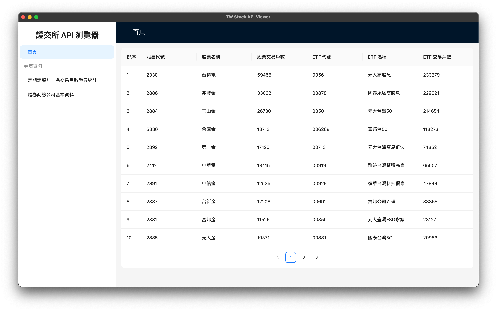

# 證交所 Open API 資料瀏覽器



## 簡介

本網頁為練習專案，嘗試將台灣證券交易所的 API 資料呈現在網頁上，資料內容皆為證交所提供。

證交所 API 文件：[Swagger UI](https://openapi.twse.com.tw/)

## 技術堆疊

- [React](https://reactjs.org/)
- [React Router](https://reactrouter.com/)
- [react-i18next](https://react.i18next.com/)
- [Ant Design](https://ant.design/)

## 如何啟動

> 本專案於 node 20.9.0 環境開發

```bash
# 安裝相依
$ yarn

# 建置專案
$ yarn build

# 啟動預覽
$ yarn preview
```

或者使用 Docker 啟動

```bash
# 建立 Docker Image
$ docker build -t tws-open-api-viewer:demo .

# 啟動 Docker Container
$ docker run --rm -p 3000:80 tws-open-api-viewer:demo
```

### 資料更新

因證交所 API 無法跨網域存取，因此使用本地的靜態檔案作為資料來源，如需更新資料請執行以下指令：

```bash
# 更新資料
$ yarn update-data
```
